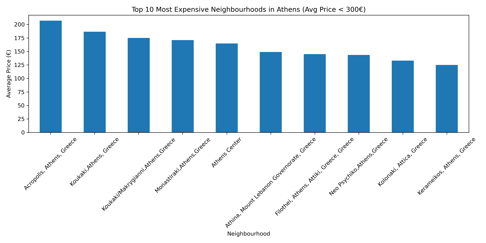

# athens-airbnb-analysis
Exploratory analysis of Airbnb prices in Athens

# Athens Airbnb Price Analysis

## Objective
Explore Airbnb prices in Athens and identify pricing patterns across neighbourhoods.

## Dataset
The dataset was obtained from Kaggle and contains Airbnb listings in Athens.

The analysis focuses on the following variables:
- "price": nightly price of the listing
- "neighbourhood": area where the listing is located

Each observation represents a single Airbnb listing.

## Key Insight
Airbnb prices vary significantly across neighbourhoods, with central areas
showing higher average prices.

## Visualization

